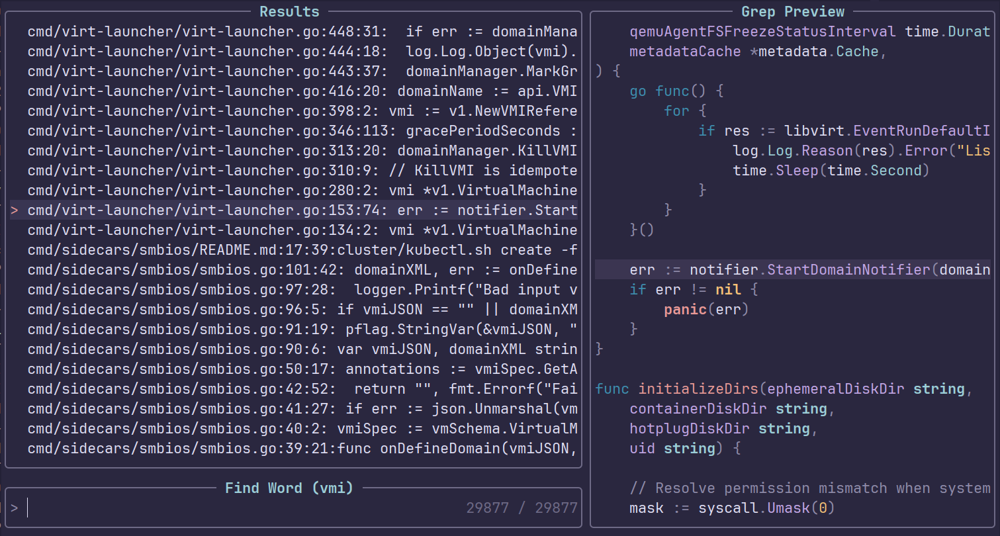

### this is a fork from the famous rc - ThePrimeagen's init.lua

## This is modified for my personal use but feel free to use it , it has following modifications
- clipboard and yank in sync(solved the buffer sync during explorer)
- ctrl C , ctlr X ,ctrl V , ctrl A work as usual in insert mode(copy, cut , paste , select all respectively)
- alt + arrow keys to move lines up and down (to recreate VS code vibes)
- different cursors for Normal , Insert and Relpace modes
- removed the extras like caleb , cockpit and plenary from the original one
- treesitter parses files upto 1mb large
- works well with go
- supports copilot auto completion

- improved fuzzyfinder with preview parsing

Link to harpoon-2(side branch) as Harpoon(master branch) has some functions that misbehave , I'd upload the corrected version someday.